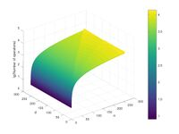
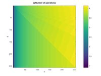

# Brainfuck

## Introduction


This repository contains brainfuck program collected from
several sources, some can be found under `archive/`

The most of the brainfuck code can be found under `bf/`,

`sources/` contain software too compile the programs yourself,
for the easy of use, several are compiled under `tools`. Some
are not compiled because they are for target (hardware) not
being used, etc etc.


## History
---
Brainfuck was invented by Urban Müller in 1993, in an attempt to make a language for which he could write the smallest possible compiler for the Amiga OS, version 2.0. He managed to write a 240-byte compiler. The language was inspired by FALSE, which had a 1024-byte compiler. Müller chose to name the language brainfuck (with the initial letter in lower case, although it is now often capitalised).

It is not known to what extent Müller was aware of or influenced by Böhm's language P'' published in 1964, of which brainfuck can be considered a minor variation.


## Language instruction set.

```
> increment the data pointer
  to point to the next cell to the right

< decrement the data pointer
  to point to the next cell to the left

+ increment (increase by one) the
  byte at the data point

- decrement (decrease by one) the
  byte at the data point

. output the byte at the data pointer

, accept one byte of input, storing
  it's value in the byte at the data pointer

[ if the byte at the data pointer is
  zero, then instead of moving the
  instuction pointer forward to the
  next command, jump it forward to
  the command after the matching ]
  command

] if the byte at the data pointer is nonzero,
  then instead of moving the instruction pointer
  forward to the next command, jump it
  back to the command after the matching
  ] command.

  Any other character are ignored; and should be seen as documentation
  There are some commen brainfuck extensions with a couple of more
  instructions; and any brainfuck program should be backwards-compatible
```

Because brainfuck does not have a formal language specification;

see Portability there are multiple dialects, some interpeters have extentions

```
# Some implementations, use it to dumb the internal state of the programming,
  usefull for debugging purposes. This command originated as a feature of Urban
  Müller original interpreter in C; there it outputs the values of the first
  10 cells in decimals, and indicates the pointer's location

! Separate brainfuck programs from the input for them.
  This is done for brainfuck interpreters in brainfuck, because these
  interpreters must receive both programs and input via brainfuck's single
  input channel and must distingquish them somehow.

  Frans Faase's brainfuck interpreter in brainfuck,
  Daniel B Cristofani also uses it in his implementation,
```

## Basic C equivalent code

```
char array[30000] = {0};
char *ptr = &array[0];

++ptr;              // >
--ptr;              // <
++*ptr;             // +
--*ptr;             // -
putchar(*ptr);      // .
scanf(" %c, ptr);   // ,
while (*ptr) {      // [
}                   // ]
```


## Code
---

A lot of code in brainfuck-programs are written by other people, and
some provide there own copyright statement, but some don't.

If the writter was known, but not in the file itself; I (MSD) modified the
files to reflect that; in the format: `(C) Copyright <name>`

## File extension

`.b` should be used instand of `.bf`, the last one is for
<a href="https://esolangs.org/wiki/Befunge">befunge.</a>

## Portability

### Implementation issues

Brainfuck leaves a lot of things up to the implementation to decide, such as
array and cell size, and what happens when EOF is read.

#### Memory and wrapping
The size of the cells and the cell array varies a lot in different implementations. A usual implementation will have either 8bit or 32bit cells with 30000 cells (in the positive direction). For Turing completeness either the number of cells must be unbounded or (at least) three unbounded cells are required, the former is usually assumed.

Urban Müller's compiler used an array of 30000 cells 8bit cells, while the interpreter only allowed 100 (of 5000) to be used. As the compiler was written in assembler there is no indication as to whether the cells are to be assumed to be signed or unsigned and the overflow semantics are of the usual twos complement (or unsigned byte) wrapping form. The interpreter uses signed 8bit characters (-128 to 127 range).

Other interpreters normally use a similar layout, however, some allow cells to the left of the start position or use different allowed ranges of cell values. Some limit the cells to only positive values or other reduced ranges, others allow a larger range including 'floating point' (which would usually be in effect a 53bit integer without wrapping) or even completely unbounded integers.

Note, that it's not possible for a brainfuck program to determine if its integers are officially signed or unsigned unless they are also non-wrapping. If the cells don't wrap then the loops `[-]` and `[+]` used after an number in the opposite direction will cause a crash (ie: an exception or a hang). Most optimisers will therefore assume these sequences set a zero even with unbounded integers.

Even with wrapping cells code can be written that depends on the cell size for example Brainfuck bitwidth conversions or the code below (which only works correctly with 8bits).

```bf
+[[->]-[-<]>-]>.>>>>.<<<<-.>>-.>.<<.>>>>-.<<<<<++.>>++.
```

#### Newlines

The vast majority of brainfuck programs, following Urban Müller's original example programs, use 10 as newline on both input and output; this is also the convention used by Unix-based operating systems, including Linux and Mac OS X. Some other operating systems use different conventions for newline, and may use different conventions on input and on output, and different conventions in different programming environments (e.g. C versus assembly language). Several solutions to the problem are possible:

  -  Write brainfuck programs to accept multiple linefeed conventions. (Possible, though clunky, on input; not generally possible on output.)
  -  Write many versions of each brainfuck program, one for each programming environment. (Possible, but very unpleasant.)
  -  Forget portability and write programs for whatever implementation you are using. (A fairly common approach. May make it hard to share programs if your interpreter doesn't use 10 as newline.)
  -  Write brainfuck interpreters and compilers to translate newline to 10 on input, and 10 to newline on output, in environments where that is not already the case. (Easy and helpful, but often overlooked. Also, may break the few brainfuck programs that do binary i/o; so newline translation should ideally be able to be turned off with a switch.)
  -  Instead of having the user hit the "Enter" key, expect the user to do something else to give a 10 to the interpreter; e.g., the user can feed the input from a file which uses 10s to end the lines, rather than from the keyboard. Send the output to a file too. (Possible but clunky.)

A few implementations allow the input to be "raw" and sometimes non-blocking. If the input is in "raw" mode it is not line buffered and key presses are passed to the program immediately. Non-blocking means that if there isn't a character available either immediately or after a short delay (for example 1/10 of a second) the input command will return an EOF indication.

#### EOF

EOF is a controversial issue. Many implementations return 0, some return -1, and several notable brainfuck programmers suggest that on EOF the memory cell should be left as-is, without modification. In the original distribution the compiler left the cell unchanged, while the interpreter used the EOF from C which, strictly speaking, could be any negative integer, but which usually is -1 (which, in the case of byte-sized cells, ends up as 255).

### Conventions

The following summarizes the common conventions for making a brainfuck
interpreter or compiler. It can be seen as a general specification for
brainfuck, commonly accepted amongst the brainfuck community as a minimal base.
It attempts to solve implementation issues by standardizing them.


#### Memory

  - Memory should normally consist of 8 bit cells, a very fast compiler may use 32bit or larger cells. Floating point cells are strongly discouraged as are cells that are not a power of two in size. "Bignum" cells are allowed but should be an option.
  -  Memory should wrap on overflow and underflow. (This also includes the [-] function with "bignum" cells).
  -  Negative memory addresses should NOT be assumed to exist, however, an interpreter may provide some. (An optimising interpreter may be forced to)
  -  Memory should consist of at least 30000 cells, some existing brainfuck programs do need more so this should
  be configurable or unbounded.

### Newlines

The input should be "line buffered" until the user enters a newline at which point the program receives the edited line.

  - OS newlines should be converted to 10 for input.
  - 10s should be converted to OS newlines for output.

Note that most programming platforms and programming
languages already do this for you, which might make converting
10s to OS newlines redundant.

### Character set

The original brainfuck interpreter used the native character set
of the host, ISO8859-1. Most modern brainfuck interpreters do the
same, so this means that many current implementations will used
UTF-8 as the character set and have access to ANSI control sequences.
The majority of brainfuck programs only use ASCII with newlines,
but the few that use extended sets follow the UTF-8+Ansi pattern.

### EOF

An interpreter should normally either return Zero or leave the
cell unchanged on EOF.

The Zero option matches the brainfuck language in that the only
conditional in brainfuck is a comparison with zero. Using this
form, in theory, allows slightly shorter code. For eight bit cells
the "leave the cell untouched" matches the C/Unix read(2) system
call in that the character memory will be left unchanged on EOF.
For Unix the EOF (or error) condition is signalled by the return
value, which is lost with BF. If the interpreter's cells are more
than eight bits the "unchanged cell" can safely handle binary data.
If the cells are eight bit or the interpreter sets the cells to zero
on EOF binary data cannot be handled.

For a brainfuck program this means that ASCII data+EOF should be
read using a `[-]`, construct (or similar). Binary input should,
probably, be read using a construct of the form `[-]-,.` This
requires that input bytes are in the range 0..255 when the cell
size exceeds eight bits.

Note: It is strongly recommended that an interpreter be
configurable to all three normal form of EOF
 - Zero
 - Minus one
 - unchanged

## Extensions

Some implementations also recognize the following symbols as meaningful:

```bf
# Start debugger show contents of first few memory cells)
! Separate code from input
```

The debug command `#` comes from brainfuck's original interpreter,
written by Urban Müller. Because brainfuck programs have only one
input source, brainfuck interpreters written in brainfuck (or other
languages without file I/O) require ! to be able to distinguish a
program's code from the input it is intended to process.

As all characters other than ><+-.,[] should be considered comments
and ignored it is normal for an interpreter to have a method of
disabling these extensions if required. This disabling may be
automatic for '!' based on such things as if there is currently an
open loop and/or if the program is being read from the 'standard
input'.

As these commands are non-standard some interpreters use different codes for these functions.

Probably the next most frequently implemented extension is a command
to comment out the rest of the line, however, experienced brainfuck
programmers generally consider this useless mostly due to the
existence of the header comments technique.

## Brainfuck algorithms

This article presents a number of algorithms for use with the Brainfuck language.

In the interest of generality, the algorithms will use variable names in place of the < and > instructions. Temporary cells are denoted "temp". When using an algorithm in a program, replace the variable names with the correct number of < or > instructions to position the pointer at the desired memory cell.

Example:

If "a" is designated to be cell 1, "b" is cell 4, and the pointer is currently at cell 0, then:

```bf
a[b+a-]
```

becomes:

```bf
>[>>>+<<<-]
```

If a particular algorithm requires cell value wrapping, this will
be noted, along with a non-wrapping version, if known. Certain
assumptions, such as that a temporary memory cell is already zero,
or that a variable used for computation can be left zeroed, are not
made. Some optimizations can therefore be performed when exact
conditions are known.

## Header comment
---

The usefulness of this type of comment is that instructions commonly used for punctuation (such as "," and ".") may be used freely. The use of "[" and "]" inside a comment should be avoided, unless they are matched. This commenting style does not work well for internal code comments, unless strategically placed where the cell value is known to be zero (or can be modified to be zero and restored):

```bf
[comment]
```

To make no assumption about the initial cell value, use:

```bf
[-][comment]
```

Since loops only terminate when / if the current cell is zeroed,
comments can safely be placed directly behind any other loop.

```bf
,[.,][comment]
```

## Read all characters into memory
---

```bf
,[>,]
```

## Read until newline/other char
---
```bf
----------[++++++++++>,----------]++++++++++
```
Adjust the number of +/- to the char code you want to match.
Omit the final + block to drop the char. Requires wrapping.

## Read until any of multiple chars
---

```bf
+>[
  >,
  (-n1)[(+n1)[>+<-]]>[<+>-]<
  (-n2)[(+n2)[>+<-]]>[<+>-]<
  etc
]
```
(+/-n1) means repeat that operator n1 times. n1, n2 etc are the
char codes you want to match. One line for each.

## x = 0

### Wrapping
```bf
x[-]
```

## Non-Wrapping
---
`Attribution: quintopia`

```bf
temp[-]†
>[-]†
x<[-]>[†
  temp>-[x+temp+>+]
  x[temp>]
  <[+[x-temp>-<-]x<]
  >
]
temp[-]
>[+]
```
† Each of these lines should have their polarities reversed if
temp, the cell to the right of temp, and the cell to the left
of x, respectively, contain a negative value.]

---
`Attribution: JungHwan Min`

Note that rather than just clearing the two cells at temp, one could condition upon the sign that x had.
```bf
x
>[-]
>[-]
<<
[
 >+[-<+>>+<]
 <[>]>
 [
  +[-<+<->>]
  <[->+<]
 ]
 >[-<+>]
 <<
]
>[-]<
```

Uses x and two cells to the right of it.

## x = y
---
```bf
temp0[-]
x[-]
y[x+temp0+y-]
temp0[y+temp0-]
```

## x = y
---
### Wrapping
```bf
temp0[-]
y[x+temp0+y-]
temp0[y+temp0-]
```
```bf
y[-x+y]x
```
## x = x - y
---
### Wrapping
```bf
temp0[-]
y[x-temp0+y-]
temp0[y+temp0-]
```
## x = x * y
---

```bf
temp0[-]
temp1[-]
x[temp1+x-]
temp1[
 y[x+temp0+y-]temp0[y+temp0-]
temp1-]
```

## x = x * x
---
`Attribution: Softengy`

```bf

x[temp0+x-]
temp0[-[temp1+x++temp0-]x+temp1[temp0+temp1-]temp0]
```

## x = x / y
---
`Attribution: Jeffry Johnston`

```bf
temp0[-]
temp1[-]
temp2[-]
temp3[-]
x[temp0+x-]
temp0[
 y[temp1+temp2+y-]
 temp2[y+temp2-]
 temp1[
  temp2+
  temp0-[temp2[-]temp3+temp0-]
  temp3[temp0+temp3-]
  temp2[
   temp1-
   [x-temp1[-]]+
  temp2-]
 temp1-]
 x+
temp0]

```

### Wrapping
---
`Attribution: Softengy`

This algorithm will compute x / y, put the remainder into x and
put the quotient into q

```bf

x[
 temp1+[
  y[x-[temp1+†]temp1-temp0+y-]
  temp0[y+temp0-]q+temp1
 ]
]
x[y[temp0+x+y-]temp0[y+temp0-]q-†]
```
† Move to any location with a value of 0

## x = x ^ y
---
`Attribution: chad3814`

```bf

temp0[-]
x[temp0+x-]
x+
y[
  temp1[-]
  temp2[-]
  x[temp2+x-]
  temp2[
    temp0[x+temp1+temp0-]
    temp1[temp0+temp1-]
  temp2-]
y-]
```

 ## swap x, y
---
 ```bf
temp0[-]
x[temp0+x-]
y[x+y-]
temp0[y+temp0-]
 ```

 ### Wrapping
 ```bf
 x[-temp0+y-x]
y[-x+y]
temp0[-y+x+temp0]
```

## x = -x
---
### Wrapping

```bf
temp0[-]
x[temp0-x-]
temp0[x-temp0+]
```

### Non-Wrapping

Requires another variable signx, where 0 = positive, 1 = negative.

```bf
temp0[-]+
signx[temp0-signx-]
temp0[signx+temp0-]
```

## x = not x (bitwise)
---
### Wrapping

```bf
temp0[-]
x-
[temp0-x-]
temp0[x+temp0-]
```
Another version:
```bf
x-[[-]+y](y-1)
```
Note that y is just for pointer-placing. Remember to let x be
the #x th(x>=1) and y to be greater than x.

### Non-Wrapping

Produces an answer for 8-bit cells. For other sized cells, set
temp1 to 2^(bits)-1.

```bf
temp0[-]
temp1[-]+++++++++++++++[temp0+++++++++++++++++temp1-]
x[temp0-x-]
temp0[x+temp0-]
```

## Find a zeroed cell
---

To the right:
```bf
[>]
```
To the left:
```bf
[<]
```
## x(y) = z (1-d array) (2 cells/array element)
---
`Attribution: Jeffry Johnston`

x(y) = z (1-d array) (2 cells/array element)

```bf
temp0[-]
temp1[-]
temp2[-]
y[temp1+temp2+y-]temp2[y+temp2-]
z[temp0+temp2+z-]temp2[z+temp2-]
x>>[[>>]+[<<]>>-]+
 [>>]<[-]<[<<]
 >[>[>>]<+<[<<]>-]
 >[>>]<<[-<<]
```

The code up through "`-]+`" creates a trail of 1's that the later
loops will use to find the destination cell. The cells are grouped
as "data cell, 1-cell". The destination cell is "data cell,
0-cell", so that the "`[>>]`" stops in a useful place. The x cell
is always 0, and serves as the left-side stop for the "`[<<]`"
statements (notice that t1 is cleared by the first loop, but the
loop's trailing "+" converts it to the first 1-cell in the trail).
Next, the trail is followed and "[-]" clears the destination cell.
The array is now prepared, so an add-to loop of the form
"`temp0[dest+temp0-]`" moves the value in temp0 to the
destination cell. Finally, with "`>[>>]`" the trail of 1's is
followed one last time forward, and cleared on the way back,
ending at the left stop, x. Contiguous memory required for the
array is 3 + 2 * number of array elements.

## x = y(z) (1-d array) (2 cells/array element)
---
`Attribution: Jeffry Johnston`

The cells representing y, temp0, and temp1 must be contiguous,
with x being the leftmost cell and temp1 the rightmost, followed
by adequate memory for the array. Each array element requires
2 memory cells. The pointer ends at y.

```bf
x[-]
temp0[-]
temp1[-]
z[temp1+temp0+z-]temp0[z+temp0-]
y>>[[>>]+[<<]>>-]+[>>]<[<[<<]>+< (pointer is at y)
 x+
y>>[>>]<-]<[<<]>[>[>>]<+<[<<]>-]>[>>]<<[-<<]
```

## x(y) = z (1-d array) (1 cell/array element)
---
`Attribution: Tritonio`

The cells representing space, index1, index2 and Data must be
contiguous and initially empty (zeroed), with space being the
leftmost cell and Data the rightmost, followed by adequate memory
for the array. Each array element requires 1 memory cell.
The pointer ends at space. index1, index2 and Data are zeroed at
the end.

```bf
z[-space+data+z]space[-z+space]
y[-space+index1+y]space[-y+space]
y[-space+index2+y]space[-y+space]
>[>>>[-<<<<+>>>>]<[->+<]<[->+<]<[->+<]>-]
>>>[-]<[->+<]<
[[-<+>]<<<[->>>>+<<<<]>>-]<<

```
## x = y(z) (1-d array) (1 cell/array element)
---
`Attribution: Tritonio`

The cells representing space, index1, index2 and Data must be
contiguous and initially empty (zeroed), with space being the
leftmost cell and Data the rightmost, followed by adequate memory
for the array. Each array element requires 1 memory cell. The
pointer ends at data. index1, index2 and Data are zeroed at the end.

```bf
z[-space+index1+z]space[-z+space]
z[-space+index2+z]space[-z+space]
>[>>>[-<<<<+>>>>]<<[->+<]<[->+<]>-]
>>>[-<+<<+>>>]<<<[->>>+<<<]>
[[-<+>]>[-<+>]<<<<[->>>>+<<<<]>>-]<<
x[-]
data[-x+data]
```

## x = x == y
---

### Wrapping

Attribution: Jeffry Johnston
The algorithm returns either 0 (false) or 1 (true) and preserves y.

```bf
temp0[-]
temp1[-]
x[temp1+x-]+
y[temp1-temp0+y-]
temp0[y+temp0-]
temp1[x-temp1[-]]
```

And if you don't need to preserve x or y, the following does the task
without requiring any temporary blocks. Returns 0 (false) or 1 (true).

```bf
x[-y-x]+y[x-y[-]]
```
It is similar to z = x xnor y.

## x = x != y
`Attribution: Jeffry Johnston`

The algorithm returns either 0 (false) or 1 (true).

```bf
temp0[-]
temp1[-]
x[temp1+x-]
y[temp1-temp0+y-]
temp0[y+temp0-]
temp1[x+temp1[-]]
```

It is similar to z = x xor y.
---
`Attribution: Yuval Meshorer`

Sets x to be 1 if x == y, 0 otherwise.

```bf
x[
 y-x-]
y[[-]
 x+y]
```

## x = x < y
---
`Attribution: Ian Kelly`

x and y are unsigned. temp1 is the first of three consecutive
temporary cells. The algorithm returns either 0 (false) or 1 (true).

```bf

temp0[-]
temp1[-] >[-]+ >[-] <<
y[temp0+ temp1+ y-]
temp0[y+ temp0-]
x[temp0+ x-]+
temp1[>-]> [< x- temp0[-] temp1>->]<+<
temp0[temp1- [>-]> [< x- temp0[-]+ temp1>->]<+< temp0-]
```

## x = x <= y
---
`Attribution: Ian Kelly`

x and y are unsigned. temp1 is the first of three consecutive
temporary cells. The algorithm returns either 0 (false) or 1 (true).

```bf
temp0[-]
temp1[-] >[-]+ >[-] <<
y[temp0+ temp1+ y-]
temp1[y+ temp1-]
x[temp1+ x-]
temp1[>-]> [< x+ temp0[-] temp1>->]<+<
temp0[temp1- [>-]> [< x+ temp0[-]+ temp1>->]<+< temp0-]
```

## z = x > y
---
`Attribution: ais523`

This uses balanced loops only, and requires a wrapping implementation (and will be very slow with large numbers of bits, although the number of bits otherwise doesn't matter.) The temporaries and x are left at 0; y is set to y-x. (You could make a temporary copy of x via using another temporary that's incremented during the loop.)

```bf
temp0[-]temp1[-]z[-]
x[ temp0+
       y[- temp0[-] temp1+ y]
   temp0[- z+ temp0]
   temp1[- y+ temp1]
   y- x- ]
```

## z = sign(x-y)
---
`Attribution: quintopia`

This is a comparison of two numbers for non-wrapping implementations. The signs of the two numbers must be known. Part of it can also be used to find the sign of an unknown number if both it and its opposite are available. z and the four cells to its right must be free and clear (and will be again when the algorithm terminates), an assumption that must be made in a non-wrapping implementation, as the direction to clear these cells could not be known to this algorithm. The code blocks indicated by parenthetical comments could contain code which depends on the result of the comparison; there is no particular reason in practice to wait for the value of z to be set to one of {-1,0,1}.


```bf


x[z>>+>-x-]†
y[z>>->+y-]†
z+>>
[->-[>]<<]
<[
  (y>=x)
  -
  >>[
    (y>x)
    <<+>>[+]
  ]<
]
>>[
  (x>y)
  [+]
]
<<<
```
(put an {if 0, then do} algorithm here to run code conditional on y=x)

†The polarity of these lines should be reversed if x and y are negative.

## x = not x (boolean, logical)
---
`Attribution: Jeffry Johnston`

The algorithm returns either 0 (false) or 1 (true).
```bf
temp0[-]
x[temp0+x[-]]+
temp0[x-temp0-]
```
---
`Attribution: Sunjay Varma`

Another version for when you can consume x (mutate its value). Also assumes that x is either 0 or 1. If you do not want to consume x, you can still use this algorithm. Just copy x to another cell, then apply the operation. The algorithm returns either 0 (false) or 1 (true).

```bf

temp0[-]+
x[-temp0-]temp0[x+temp0-]
```
Modification of Sunjay's version above.

```bf
temp0[-]+
x[[-]temp0-x]temp0[-x+temp0]
```
Then there's undoubtedly no mistake. When x>1, the result will be as same as x=1 .

---
`Attribution: Yuval Meshorer`

Even another version that consumes x. Returns 0 (false) if x is 1 (true) and 1 if x is 0.

```bf
temp0[-]
x[temp0-x-]temp0+
```
---
`Attribution: FSHelix`

A harder-to-understand version that actually is "y = not x", which preserves x but needs 3 continuous cells in total.
Maybe using it for calculating "y = not x" is not necessary, but I think this idea will be quite useful in some cases.
In fact the idea is also embodied in other codes in this page.

#Define these 3 cells as x, y=1 and t=0.

```bf


x>y[-]+>t[-]<<x
[>y[-]]>[>t]
```

According to whether x==0 or not, there are two different run modes because the position of the pointer changes in the "[]" loop.
The following is the process of the second line, "*" means the pointer is here.


```bf
If x==0:                           If x!=0:
                  x  y  t                            x  y  t
                 *0  1  0                           *1  1  0
[>y[-]]          *0  1  0          [>y[-]]           1 *0  0
[>y[-]]>          0 *1  0          [>y[-]]>          1  0 *0
[>y[-]]>[>t]      0  1 *0          [>y[-]]>[>t]      1  0 *0

```
`Attribution: A`

Another version:

```bf

y+x[-y-x]+y[x-y[-]]x

```

## x = x and y (boolean, logical)
---
`Attribution: Jeffry Johnston`

The algorithm returns either 0 (false) or 1 (true).

```bf

temp0[-]
temp1[-]
x[temp1+x-]
temp1[
 temp1[-]
 y[temp1+temp0+y-]
 temp0[y+temp0-]
 temp1[x+temp1[-]]
]
```
---
`Attribution: Sunjay Varma`

Consumes x and y (leaves them as zero at the end of the algorithm) and stores the result in z. For short-circuit evaluation, don't evaluate x or y until just before they are used.

The algorithm returns either 0 (false) or 1 (true).

```bf
z[-]
x[
 y[z+y-]
 x-
]
y[-]
```
---
`Attribution: Yuval Meshorer`

Consumes x and y and outputs 1 in z if both x and y are 1, else 0.

```bf
z[-]
x[
 -y[-z+y]
 x]
```

<table class="wikitable">

<tbody><tr>
<th colspan="2">INPUT</th>
<th></th>
<th colspan="3">OUTPUT
</th></tr>
<tr>
<th>x</th>
<th>y</th>
<th></th>
<th>x</th>
<th>y</th>
<th>z
</th></tr>
<tr>
<td>0</td>
<td>0</td>
<td></td>
<td>0</td>
<td>0</td>
<td>0
</td></tr>
<tr>
<td>0</td>
<td>1</td>
<td></td>
<td>0</td>
<td>0</td>
<td>0
</td></tr>
<tr>
<td>1</td>
<td>0</td>
<td></td>
<td>0</td>
<td>0</td>
<td>0
</td></tr>
<tr>
<td>1</td>
<td>1</td>
<td></td>
<td>0</td>
<td>0</td>
<td>1
</td></tr></tbody></table>

## x = x or y (boolean, logical)

### Wrapping

`Attribution: Jeffry Johnston`

The algorithm returns either 0 (false) or 255 (true).

```bf

temp0[-]
temp1[-]
x[temp1+x-]
temp1[x-temp1[-]]
y[temp1+temp0+y-]temp0[y+temp0-]
temp1[x[-]-temp1[-]]
```
---

`Attribution: Yuval Meshorer`

Returns 1 (x = 1) if either x or y are 1 (0 otherwise)
If you use it in the case that x>1 or y>1,please make sure it won't cause overflow problem.
For example,if x=1 and y=255, than x will be 0.

```bf

x[
 y+x-]
y[
 x+y[-]
]
```

---
`Attribution: Sunjay Varma`

Consumes x and y (leaves them as zero at the end of the algorithm) and stores the result in z. For short-circuit evaluation, don't evaluate x or y until just before they are used.

If you don't care about short-circuit evaluation, temp0 can be removed completely. If temp0 is removed and both x and y are 1, z will be 2, not 1. This is usually not a problem since it is still non-zero, but you should keep that in mind.
Or there's a way to fix it, add these codes to the end:

```bf
z[x+z[-]]
x[z+x-]
```

```bf
z[-]
temp0[-]+
x[
 z+
 temp0-
 x-
]
temp0[-
 y[
  z+
  y-
 ]
]
y[-]
```
---
`Attribution: Yuval Meshorer`

Consumes x and y, does not use a temporary cell. Makes z 1 (true) or 0 (false) if either x or y are one.

```bf
z[-]
x[y+x-]
y[[-]
z+y]
```
<table class="wikitable">
<tbody><tr>
<th colspan="2">INPUT</th>
<th></th>
<th colspan="4">OUTPUT
</th></tr>
<tr>
<th>x</th>
<th>y</th>
<th></th>
<th>x</th>
<th>y</th>
<th>z</th>
<th>temp0
</th></tr>
<tr>
<td>0</td>
<td>0</td>
<td></td>
<td>0</td>
<td>0</td>
<td>0</td>
<td style="text-align: center;">0
</td></tr>
<tr>
<td>0</td>
<td>1</td>
<td></td>
<td>0</td>
<td>0</td>
<td>1</td>
<td style="text-align: center;">0
</td></tr>
<tr>
<td>1</td>
<td>0</td>
<td></td>
<td>0</td>
<td>0</td>
<td>1</td>
<td style="text-align: center;">0
</td></tr>
<tr>
<td>1</td>
<td>1</td>
<td></td>
<td>0</td>
<td>0</td>
<td>1</td>
<td style="text-align: center;">0
</td></tr></tbody></table>

## x = x nor y (boolean, logical)
---
`Attribution: FSHelix`

Consumes x and y and outputs 0 in x if both x and y are 1, else 1. Used an extra cell "z" to avoid the overflow problem like the one mentioned in x = x or y.

```bf
x[z+x[-]]
y[z+y[-]]
z[x+z[-]]
```

<table class="wikitable"><tbody><tr>
<th colspan="2">INPUT</th>
<th></th>
<th colspan="2">OUTPUT
</th></tr>
<tr>
<th>x</th>
<th>y</th>
<th></th>
<th>x</th>
<th>y
</th></tr>
<tr>
<td>0</td>
<td>0</td>
<td></td>
<td>0</td>
<td>1
</td></tr>
<tr>
<td>0</td>
<td>1</td>
<td></td>
<td>0</td>
<td>0
</td></tr>
<tr>
<td>1</td>
<td>0</td>
<td></td>
<td>0</td>
<td>0
</td></tr>
<tr>
<td>1</td>
<td>1</td>
<td></td>
<td>0</td>
<td>0
</td></tr></tbody></table>

## z = x xor y (boolean, logical)
---
`Attribution: Yuval Meshorer`

Consumes x and y. Makes z 1 (true) or 0 (false) if x does not equal y. Finishes at y.

```bf
z[-]
x[y-
 x-]
y[z+
 y[-]]
```

<table class="wikitable"><tbody><tr>
<th colspan="2">INPUT</th>
<th></th>
<th colspan="4">OUTPUT
</th></tr>
<tr>
<th>x</th>
<th>y</th>
<th></th>
<th>x</th>
<th>y</th>
<th>z
</th></tr>
<tr>
<td>0</td>
<td>0</td>
<td></td>
<td>0</td>
<td>0</td>
<td>0
</td></tr>
<tr>
<td>0</td>
<td>1</td>
<td></td>
<td>0</td>
<td>0</td>
<td>1
</td></tr>
<tr>
<td>1</td>
<td>0</td>
<td></td>
<td>0</td>
<td>0</td>
<td>1
</td></tr>
<tr>
<td>1</td>
<td>1</td>
<td></td>
<td>0</td>
<td>0</td>
<td>0
</td></tr></tbody></table>

# z = x xnor y (boolean, logical)
---
`Attribution: FSHelix`

Consumes x and y. Makes z 1 (true) or 0 (false) if x equal y. Finishes at y.

```bf
z[-]+
x[
  y-
  x-
]
y[
  z-
  y[-]
]
```

<table class="wikitable"><tbody><tr>
<th colspan="2">INPUT</th>
<th></th>
<th colspan="4">OUTPUT
</th></tr>
<tr>
<th>x</th>
<th>y</th>
<th></th>
<th>x</th>
<th>y</th>
<th>z
</th></tr>
<tr>
<td>0</td>
<td>0</td>
<td></td>
<td>0</td>
<td>0</td>
<td>1
</td></tr>
<tr>
<td>0</td>
<td>1</td>
<td></td>
<td>0</td>
<td>0</td>
<td>0
</td></tr>
<tr>
<td>1</td>
<td>0</td>
<td></td>
<td>0</td>
<td>0</td>
<td>0
</td></tr>
<tr>
<td>1</td>
<td>1</td>
<td></td>
<td>0</td>
<td>0</td>
<td>1
</td></tr></tbody></table>

# z = MUX(a, x, y) (boolean, logical)
---
`Attribution: Yuval Meshorer`

If a is equal to 1, then z is equal to y. Otherwise, if a is equal to 0, z will be equal to x. When done, a, x, and y will all be 0 regardless of their starting values. e.g: IN: x = 0, y = 1, a = 1 OUT: x = 0, y = 0, a = 0, z = 1

```bf
z[-]
y[
 a[z+a-]
y-]
x[
 a-[
  [-]z[-]+
 a]
x-]
a[-]
```

<table class="wikitable">

<tbody><tr>
<th colspan="3">INPUT</th>
<th></th>
<th colspan="4">OUTPUT
</th></tr>
<tr>
<th>a</th>
<th>x</th>
<th>y</th>
<th></th>
<th>z
</th></tr>
<tr>
<td>0</td>
<td>0</td>
<td>0</td>
<td></td>
<td>0
</td></tr>
<tr>
<td>0</td>
<td>0</td>
<td>1</td>
<td></td>
<td>0
</td></tr>
<tr>
<td>0</td>
<td>1</td>
<td>0</td>
<td></td>
<td>1
</td></tr>
<tr>
<td>0</td>
<td>1</td>
<td>1</td>
<td></td>
<td>1
</td></tr>
<tr>
<td>1</td>
<td>0</td>
<td>0</td>
<td></td>
<td>0
</td></tr>
<tr>
<td>1</td>
<td>0</td>
<td>1</td>
<td></td>
<td>1
</td></tr>
<tr>
<td>1</td>
<td>1</td>
<td>0</td>
<td></td>
<td>0
</td></tr>
<tr>
<td>1</td>
<td>1</td>
<td>1</td>
<td></td>
<td>1
</td></tr></tbody></table>

# while (x) { code }
---
`Attribution: Sunjay Varma`

To implement a while loop, you need to evaluate the condition x both before the loop and at the end of the loop body.

```bf
evaluate x
x[
 code
 evaluate x again
 x
]
```

## break and continue
---
`Attribution: Sunjay Varma`

To implement break and continue statements in loops, consider that the following two pieces of pseudocode are functionally equivalent:

```c
while (foo) {
 if (bar == foo) {
  if (x > 2) {
   break;
  }
  else {
   // do stuff
  }
  // do stuff
 }
 // update foo for the next iteration
}

// Equivalent without break statement:
while (foo) {
 shouldBreak = false
 if (bar == foo) {
  if (x > 2) {
   shouldBreak = true
  }
  else {
   // do stuff
  }

  // don't evaluate any more code in the loop after breaking
  if (!shouldBreak) {
   // do stuff
  }
 }
 if (shouldBreak) {
  // so that the loop stops
  foo = 0
 }
 else {
  // update foo for the next iteration
 }
}
```
Notice that we need to guard all code after the break statement in the loop to prevent it from running. We don't need to guard in the else statement immediately after the break statement because that will never run after the break statement has run.

This approach allows us to implement break and continue statements in brainfuck despite the lack of sophisticated jump instructions. All we're doing is combining the concept of an if statement (defined below) with the while loop we just defined and applying it here.

Implementing a continue statement is the same thing except you never guard the loop updating cod

```c
while (foo) {
 if (bar == foo) {
  if (x > 2) {
   continue;
  }
  else {
   // do stuff
  }
  // do stuff
 }
 // update foo for the next iteration
}

// Equivalent without continue statement:
while (foo) {
 shouldContinue = false
 if (bar == foo) {
  if (x > 2) {
   shouldContinue = true
  }
  else {
   // do stuff
  }

  // don't evaluate any more code in the loop after continuing
  if (!shouldContinue) {
   // do stuff
  }
 }

 // This code stays the same after a continue because we still want to move on to the next iteration of the loop
 // update foo for the next iteration
}
```
To implement both break and continue, you can compose the concepts here and make any combination you want. You can consider break and continue statements to be "sugar" that needs to be "desugared" in your brainfuck code.

## if (x) { code }
---

```bf
temp0[-]
temp1[-]
x[temp0+temp1+x-]temp0[x+temp0-]
temp1[
 code
temp1[-]]
```

or alternatively:

```bf
temp0[-]
x[
 code
 temp0
]x
```

or alternatively if you don't need x anymore:

```bf
x[
 code
 x[-]
]
```

# if (x == 0) { code }
---
The code examples in the following section work for this: if (x) { code1 } else { code2 }. Just have "code1" be empty.

# if (x) { code1 } else { code2 }
---
`Attribution: Jeffry Johnston`

```bf
temp0[-]
temp1[-]
x[temp0+temp1+x-]temp0[x+temp0-]+
temp1[
 code1
 temp0-
temp1[-]]
temp0[
 code2
temp0-]
```

`Attribution: Daniel Marschall`
```bf
temp0[-]+
temp1[-]
x[
 code1
 temp0-
 x[temp1+x-]
]
temp1[x+temp1-]
temp0[
 code2
temp0-]
```

This is an alternate approach. It's more efficient since it doesn't require copying x, but it does require that temp0 and temp1 follow x consecutively in memory.

`Attribution: Ben-Arba`

```bf
temp0[-]+
temp1[-]
x[
 code1
 x>-]>
[<
 code2
 x>->]<<
```

# x = pseudo-random number
---
`Attribution: Jeffry Johnston`

This algorithm employs a linear congruential generator of the form:

`V = (A * V + B) % M`

Where:

`A = 31821, B = 13849, M = period = 65536, V = initial seed`


A and B values were obtained from the book:

Texas Instruments TMS320 DSP DESIGNER'S NOTEBOOK Number 43 Random Number Generation on a TMS320C5x, by Eric Wilbur

Assumes 8-bit cells. After the code is executed, the variable "x" holds a pseudo-random number from 0 to 255 (the high byte of V, above). The variable cells "randomh" and "randoml" are the internal random number seed and should not be altered while random numbers are being generated.

```bf
temp0[-]
temp1[-]
temp2[-]
temp3[-]
temp4[-]
temp5[-]
randomh[temp0+randomh-]
randoml[temp1+randoml-]
temp3+++++++[temp2+++++++++++@temp3-]
temp2[
 temp0[randomh+temp3+temp0-]
 temp3[temp0+temp3-]
 temp1[randomh+temp3+temp4+temp1-]
 temp4[temp1+temp4-]
 temp3[
  randoml+[temp4+temp5+randoml-]
  temp5[randoml+temp5-]+
  temp4[temp5-temp4[-]]
  temp5[randomh+temp5-]
 temp3-]
temp2-]
++++++[temp3++++++++temp2-]
temp3-[
 temp1[randomh+temp2+temp1-]
 temp2[temp1+temp2-]
temp3-]
temp0[-]temp1[-]+++++[temp0+++++temp1-]
temp0[
 randoml+[temp1+temp2+randoml-]
 temp2[randoml+temp2-]+
 temp1[temp2-temp1[-]]
 temp2[randomh+temp2-]
temp0-]
++++++[randomh+++++++++temp0-]
randomh[x+temp0+randomh-]
temp0[randomh+temp0-]
```

## Divmod algorithm
---
A clever algorithm to compute div and mod at the same time:

```bf
# >n 0 d
[->+>-[>+>>]>[+[-<+>]>+>>]<<<<<<]
# >0 n d-n%d n%d n/d
```
If one does not need to preserve n, use this variant:
```bf
# >n d
[->-[>+>>]>[+[-<+>]>+>>]<<<<<]
# >0 d-n%d n%d n/d
```
This algorithm doesn't work when the divisor is 0 or 1.

The pictures showed its efficiency intuitively.


`Attribution: FSHelix`

Modification of the version above.

```bf
# >n d
[->[->+>>]>[<<+>>[-<+>]>+>>]<<<<<]
>[>>>]>[[-<+>]>+>>]<<<<<
# >0 d-n%d n%d n/d
```
It works when divisor >= 1, but doesn't preserve n. I've tested it for times with n = 0 ~ 255 and d = 1 ~ 255, including extreme data.

---
Attribution: FSHelix

Another version of divmod, does not preserve n. It uses 7 cells and more time to calculate, and contains 2 layers of If-Else Structure(may be optimized in future). However, it can deal with n, d = 0 ~ 255. Note that when d = 0, it returns n/d = 0 and n%d = n. All inputs have been tested out.

```bf
# >n 1 d 1 0 0 0
>+>>+<<<
[
 [
  ->->>>>>+<<<<-[>-]>[
   >>+>[-<<<<+>>>>]<<
  ]<[-]+<<
 ]>>>[>]<<<[-]+<
]
# >0 1 d-n%d 1 0 n/d n%d
```
The pictures showed its efficiency intuitively. It's obvious that versions above are faster than this. The second version's maximum number of operations is 2.30 times this.





Fixed Version

```bf
# >n d 1 0 0 0
[->-[>+>>]>[[-<+>]+>+>>]<<<<<]
# >0 d-n%d n%d+1 n/d 0 0

```
Works for all cell values. With division by zero treated as division by MaxCell+1.

# Modulus algorithm
---
If we do not need to compute the quotient as well, the following approach is shorter than the divmod algorithm.

```bf
# 0 >n 0 d 0 0 0
[>+>->+<[>]>[<+>-]<<[<]>-]
# 0 >0 n d-n%d n%d 0 0
```
As an additional advantage, this algorithm works even if the divisor is 1.

If n doesn't have to be preserved, the following variant can be used instead.
```bf
# 0 >n d 0 0 0
[>->+<[>]>[<+>-]<<[<]>-]
# 0 >0 d-n%d n%d 0 0
```
## Print value of cell x as number (8-bit)
---

```bf
x >>++++++++++<<[->+>-[>+>>]>[+[-<+>]>+>>]<<<<<<]>>[-]>>>++++++++++<[->-[>+>>]>[+[-
<+>]>+>>]<<<<<]>[-]>>[>++++++[-<++++++++>]<.<<+>+>[-]]<[<[->-<]++++++[->++++++++
<]>.[-]]<<++++++[-<++++++++>]<.[-]<<[-<+>]<
```
## Summing 1~n
---
`Attribution: Yuval Meshorer`

Copies n-1 to the cell to the right of n and n-2 to the cell to the right of that and so on until 0. Then, sums from 1 to n. Uses n+3 temp cells to the right of n

```bf
[>+<-]>
[[>+>+<<-]>>[-<<+>>]<-]<[[>[<+>-]]<<]
>[<+>-]
```

`Attribution User:A`

Puts the sum from x to y(x should be set into 1) into a.

```bf
y[x[-a+x2+x]x2[-x+x2]x+y-]
```

## Print value of cell x as number for ANY sized cell (eg 8bit, 100000bit etc)
---

Improved version using updated division routine. All used cells are cleared before and after use. This code is a little faster than before and has been tested with very large values; but as the number of BF instructions is proportional to the number being printed anything over a couple of billion needs an interpreter that can recognise the [->-[>+>>]>[[-<+>]+>+>>]<<<<<] fragment as a divmod (taking care to ensure that the prerequisites are met).

```bf
// Print value
// Cells used: V Z n d 1 0 0 0
// V is the value you need to print; it is not modified
// Z is a zero sentinal and tmp
// All cells Z and up are cleared by this routine

>[-]>[-]+>[-]+<                         // Set n and d to one to start loop
[                                       // Loop on 'n'
    >[-<-                               // On the first loop
        <<[->+>+<<]                     // Copy V into N (and Z)
        >[-<+>]>>                       // Restore V from Z
    ]
    ++++++++++>[-]+>[-]>[-]>[-]<<<<<    // Init for the division by 10
    [->-[>+>>]>[[-<+>]+>+>>]<<<<<]      // full division
    >>-[-<<+>>]                         // store remainder into n
    <[-]++++++++[-<++++++>]             // make it an ASCII digit; clear d
    >>[-<<+>>]                          // move quotient into d
    <<                                  // shuffle; new n is where d was and
                                        //   old n is a digit
    ]                                   // end loop when n is zero
<[.[-]<]                                // Move to were Z should be and
                                        // output the digits till we find Z
<                                       // Back to V

```

This alternative runs about a quarter as many BF instructions and is shorter. However, a normally optimising interpreter runs it at about the same speed. It requires about three times as many already cleaned cells two of which are to the left of the cell to be printed. All cells, including the value printed, are cleared after use.

```bf
>> x
>+
[[-]<
  [->+<
    [->+<[->+<[->+<[->+<[->+<[->+<[->+<[->+<
      [->[-]>>+>+<<<]
    ]]]]]]]]<
  ]>>[>]++++++[-<++++++++>]>>
]<<<[.[-]<<<]

```
## String to byte
---
`Attribution: By: Jonne 'YoYoYonnY' Ransijn`

Convert a string to a byte. The string is a list of characters in the following format:

```
0 0 49 48 48 0
R ^
R = Pointer at the end of the algoritm (Result)
^ = Pointer at the start of the algorithm
```

This algorithm will not check if the string is a number. It supports up to 3 digits, but is modulair, allowing the programmer to easily support more digits. Result will be placed one cell before the string.

```bf
>------------------------------------------------[<<+>>-]>
[
    <<<
    [<+>-]<
    [>++++++++++<-]>
    >>>
    ------------------------------------------------
    [<<<+>>>-]>
    [
        <<<<
        [<+>-]<
        [>++++++++++<-]>
        >>>>
        ------------------------------------------------
        [<<<<+>>>>-]
    ]
    <
]
<<<
```

## Input a decimal number
---
`Attribution: Urban Müller (1993)`

Value is input into the current cell, uses three more cells to the right. End of the number is a newline, or eof. All other character are treated the same as digits. Works correctly with bignum cells.

```bf
  [-]>[-]+                        // Clear sum
  [[-]                            // Begin loop on first temp
  >[-],                           // Clear the inp buffer to detect
                                  // leave on eof and input
    [
      +[                          // Check for minus one on eof
        -----------[              // Check for newline
          >[-]++++++[<------>-]   // Subtract 38 to get the char
                                  // in zero to nine
          <--<<[->>++++++++++<<]  // Multiply the existing value by ten
          >>[-<<+>>]              // and add in the new char
        <+>]
      ]
    ]
  <]
  <
  // Current cell is the number input
```
### Count up with step x, from y to infinity
---

```bf
x[[-y+temp+x]temp[-y+x+temp]x]
```

### while(c=getchar()!=X)
---
Uses X to represent the getchar-until char. Needs overflow and underflow in TIO. Preserves result(equal 0, unequal 1)in t1. Preserves x and y.

```bf
yXx+[,[-t1+t3+x]y[-t2+t4+y]t1[-x+t1]t2[-y+t2]t3[-t4+t3]t4[++t3]t4[-t1+t4]t1]
```

---

## bitwidth conversions

This is a set of translations to make normal 8-bit Brainfuck use 2
or 4 cells. Basically, by applying one of these conversions, you
can make a normal BF program run as its 16-bit or 32-bit version
on an 8-bit BF interpreter.

<table><tbody><tr>
<th>Original
</th>
<th>1→2
</th>
<th>1→4
</th></tr>
<tr valign="top">
<td><pre>.</pre>
</td>
<td><pre>.</pre>
</td>
<td><pre>.</pre>
</td></tr>
<tr valign="top">
<td><pre>,</pre>
</td>
<td><pre>,</pre>
</td>
<td><pre>,</pre>
</td></tr>
<tr valign="top">
<td><pre>&gt;</pre>
</td>
<td><pre>&gt;&gt;&gt;</pre>
</td>
<td><pre>&gt;&gt;&gt;&gt;&gt;</pre>
</td></tr>
<tr valign="top">
<td><pre>&lt;</pre>
</td>
<td><pre>&lt;&lt;&lt;</pre>
</td>
<td><pre>&lt;&lt;&lt;&lt;&lt;</pre>
</td></tr>
<tr valign="top">
<td><pre>+</pre>
</td>
<td>
<pre>+
[&lt;+&gt;&gt;&gt;+&lt;&lt;-]&lt;[&gt;+&lt;-]+&gt;&gt;&gt;[&lt;&lt;&lt;-&gt;&gt;&gt;[-]]&lt;&lt;&lt;[-
 &gt;&gt;+&lt;&lt;
]&gt;
</pre>
</td>
<td>
<pre>+
[&lt;+&gt;&gt;&gt;&gt;&gt;+&lt;&lt;&lt;&lt;-]&lt;[&gt;+&lt;-]+&gt;&gt;&gt;&gt;&gt;[&lt;&lt;&lt;&lt;&lt;-&gt;&gt;&gt;&gt;&gt;[-]]&lt;&lt;&lt;&lt;&lt;[-
 &gt;&gt;+
 [&lt;&lt;+&gt;&gt;&gt;&gt;&gt;+&lt;&lt;&lt;-]&lt;&lt;[&gt;&gt;+&lt;&lt;-]+&gt;&gt;&gt;&gt;&gt;[&lt;&lt;&lt;&lt;&lt;-&gt;&gt;&gt;&gt;&gt;[-]]&lt;&lt;&lt;&lt;&lt;[-
  &gt;&gt;&gt;+
  [&lt;&lt;&lt;+&gt;&gt;&gt;&gt;&gt;+&lt;&lt;-]&lt;&lt;&lt;[&gt;&gt;&gt;+&lt;&lt;&lt;-]+&gt;&gt;&gt;&gt;&gt;[&lt;&lt;&lt;&lt;&lt;-&gt;&gt;&gt;&gt;&gt;[-]]&lt;&lt;&lt;&lt;&lt;[-
   &gt;&gt;&gt;&gt;+&lt;&lt;&lt;&lt;
  ]
 ]
]&gt;
</pre>
</td></tr>
<tr valign="top">
<td><pre>-</pre>
</td>
<td>
<pre>[&lt;+&gt;&gt;&gt;+&lt;&lt;-]&lt;[&gt;+&lt;-]+&gt;&gt;&gt;[&lt;&lt;&lt;-&gt;&gt;&gt;[-]]&lt;&lt;&lt;[-
 &gt;&gt;-&lt;&lt;
]&gt;-
</pre>
</td>
<td>
<pre>[&lt;+&gt;&gt;&gt;&gt;&gt;+&lt;&lt;&lt;&lt;-]&lt;[&gt;+&lt;-]+&gt;&gt;&gt;&gt;&gt;[&lt;&lt;&lt;&lt;&lt;-&gt;&gt;&gt;&gt;&gt;[-]]&lt;&lt;&lt;&lt;&lt;[-
 &gt;&gt;
 [&lt;&lt;+&gt;&gt;&gt;&gt;&gt;+&lt;&lt;&lt;-]&lt;&lt;[&gt;&gt;+&lt;&lt;-]+&gt;&gt;&gt;&gt;&gt;[&lt;&lt;&lt;&lt;&lt;-&gt;&gt;&gt;&gt;&gt;[-]]&lt;&lt;&lt;&lt;&lt;[-
  &gt;&gt;&gt;
  [&lt;&lt;&lt;+&gt;&gt;&gt;&gt;&gt;+&lt;&lt;-]&lt;&lt;&lt;[&gt;&gt;&gt;+&lt;&lt;&lt;-]+&gt;&gt;&gt;&gt;&gt;[&lt;&lt;&lt;&lt;&lt;-&gt;&gt;&gt;&gt;&gt;[-]]&lt;&lt;&lt;&lt;&lt;[-
   &gt;&gt;&gt;&gt;-&lt;&lt;&lt;&lt;
  ]
  &gt;&gt;&gt;-&lt;&lt;&lt;
 ]
 &gt;&gt;-&lt;&lt;
]&gt;-
</pre>
</td></tr>
<tr valign="top">
<td><pre>[</pre>
</td>
<td>
<pre>[&gt;&gt;+&gt;&gt;&gt;+&lt;&lt;&lt;&lt;&lt;-]&gt;&gt;&gt;&gt;&gt;[&lt;&lt;&lt;&lt;&lt;+&gt;&gt;&gt;&gt;&gt;-]&lt;&lt;&lt;
[[-]&lt;&lt;&lt;+&gt;&gt;&gt;]&lt;
[&gt;+&gt;&gt;&gt;+&lt;&lt;&lt;&lt;-]&gt;&gt;&gt;&gt;[&lt;&lt;&lt;&lt;+&gt;&gt;&gt;&gt;-]&lt;&lt;&lt;
[[-]&lt;&lt;&lt;+&gt;&gt;&gt;]&lt;&lt;&lt;
[[-]&gt;
</pre>
</td>
<td>
<pre>[&gt;&gt;&gt;&gt;+&gt;&gt;&gt;&gt;&gt;+&lt;&lt;&lt;&lt;&lt;&lt;&lt;&lt;&lt;-]&gt;&gt;&gt;&gt;&gt;&gt;&gt;&gt;&gt;[&lt;&lt;&lt;&lt;&lt;&lt;&lt;&lt;&lt;+&gt;&gt;&gt;&gt;&gt;&gt;&gt;&gt;&gt;-]&lt;&lt;&lt;&lt;&lt;
[[-]&lt;&lt;&lt;&lt;&lt;+&gt;&gt;&gt;&gt;&gt;]&lt;&lt;&lt;
[&gt;&gt;&gt;+&gt;&gt;&gt;&gt;&gt;+&lt;&lt;&lt;&lt;&lt;&lt;&lt;&lt;-]&gt;&gt;&gt;&gt;&gt;&gt;&gt;&gt;[&lt;&lt;&lt;&lt;&lt;&lt;&lt;&lt;+&gt;&gt;&gt;&gt;&gt;&gt;&gt;&gt;-]&lt;&lt;&lt;&lt;&lt;
[[-]&lt;&lt;&lt;&lt;&lt;+&gt;&gt;&gt;&gt;&gt;]&lt;&lt;
[&gt;&gt;+&gt;&gt;&gt;&gt;&gt;+&lt;&lt;&lt;&lt;&lt;&lt;&lt;-]&gt;&gt;&gt;&gt;&gt;&gt;&gt;[&lt;&lt;&lt;&lt;&lt;&lt;&lt;+&gt;&gt;&gt;&gt;&gt;&gt;&gt;-]&lt;&lt;&lt;&lt;&lt;
[[-]&lt;&lt;&lt;&lt;&lt;+&gt;&gt;&gt;&gt;&gt;]&lt;
[&gt;+&gt;&gt;&gt;&gt;&gt;+&lt;&lt;&lt;&lt;&lt;&lt;-]&gt;&gt;&gt;&gt;&gt;&gt;[&lt;&lt;&lt;&lt;&lt;&lt;+&gt;&gt;&gt;&gt;&gt;&gt;-]&lt;&lt;&lt;&lt;&lt;
[[-]&lt;&lt;&lt;&lt;&lt;+&gt;&gt;&gt;&gt;&gt;]&lt;&lt;&lt;&lt;&lt;
[[-]&gt;
</pre>
</td></tr>
<tr valign="top">
<td><pre>]</pre>
</td>
<td>
<pre>[&gt;&gt;+&gt;&gt;&gt;+&lt;&lt;&lt;&lt;&lt;-]&gt;&gt;&gt;&gt;&gt;[&lt;&lt;&lt;&lt;&lt;+&gt;&gt;&gt;&gt;&gt;-]&lt;&lt;&lt;
[[-]&lt;&lt;&lt;+&gt;&gt;&gt;]&lt;
[&gt;+&gt;&gt;&gt;+&lt;&lt;&lt;&lt;-]&gt;&gt;&gt;&gt;[&lt;&lt;&lt;&lt;+&gt;&gt;&gt;&gt;-]&lt;&lt;&lt;
[[-]&lt;&lt;&lt;+&gt;&gt;&gt;]&lt;&lt;&lt;
]&gt;
</pre>
</td>
<td>
<pre>[&gt;&gt;&gt;&gt;+&gt;&gt;&gt;&gt;&gt;+&lt;&lt;&lt;&lt;&lt;&lt;&lt;&lt;&lt;-]&gt;&gt;&gt;&gt;&gt;&gt;&gt;&gt;&gt;[&lt;&lt;&lt;&lt;&lt;&lt;&lt;&lt;&lt;+&gt;&gt;&gt;&gt;&gt;&gt;&gt;&gt;&gt;-]&lt;&lt;&lt;&lt;&lt;
[[-]&lt;&lt;&lt;&lt;&lt;+&gt;&gt;&gt;&gt;&gt;]&lt;&lt;&lt;
[&gt;&gt;&gt;+&gt;&gt;&gt;&gt;&gt;+&lt;&lt;&lt;&lt;&lt;&lt;&lt;&lt;-]&gt;&gt;&gt;&gt;&gt;&gt;&gt;&gt;[&lt;&lt;&lt;&lt;&lt;&lt;&lt;&lt;+&gt;&gt;&gt;&gt;&gt;&gt;&gt;&gt;-]&lt;&lt;&lt;&lt;&lt;
[[-]&lt;&lt;&lt;&lt;&lt;+&gt;&gt;&gt;&gt;&gt;]&lt;&lt;
[&gt;&gt;+&gt;&gt;&gt;&gt;&gt;+&lt;&lt;&lt;&lt;&lt;&lt;&lt;-]&gt;&gt;&gt;&gt;&gt;&gt;&gt;[&lt;&lt;&lt;&lt;&lt;&lt;&lt;+&gt;&gt;&gt;&gt;&gt;&gt;&gt;-]&lt;&lt;&lt;&lt;&lt;
[[-]&lt;&lt;&lt;&lt;&lt;+&gt;&gt;&gt;&gt;&gt;]&lt;
[&gt;+&gt;&gt;&gt;&gt;&gt;+&lt;&lt;&lt;&lt;&lt;&lt;-]&gt;&gt;&gt;&gt;&gt;&gt;[&lt;&lt;&lt;&lt;&lt;&lt;+&gt;&gt;&gt;&gt;&gt;&gt;-]&lt;&lt;&lt;&lt;&lt;
[[-]&lt;&lt;&lt;&lt;&lt;+&gt;&gt;&gt;&gt;&gt;]&lt;&lt;&lt;&lt;&lt;
]&gt;
</pre>
</td></tr></tbody></table>

### Multiple conversions

It is also possible to combine these, and detect the bitwidth of the interpreter at runtime like so:

```bf
// This generates 65536 to check for larger than 16bit cells
>[-]<[-]++[>++++++++<-]>[<++++++++>-]<[>++++++++<-]>[<++++++++>-]<[>++++++++<-]+>[>
// This code is the original source for 32bit cells
...


<[-]]<
```

```bf
// This section is cell doubling for 16bit cells
>[-]<[-]++++++++[>++++++++<-]>[<++++>-]<[[-]>[-]++[<++++++++>-]<[>++++++
++<-]>[<++++++++>-]<[>++++++++<-]>[<++++++++>-]+<[>-<[-]]>[>

>...<

<[-]]<[-]]
```

```bf
// This section is cell quadrupling for 8bit cells
>[-]<[-]++++++++[>++++++++<-]>[<++++>-]+<[>-<[-]]>[>

>...<

<[-]]<
````

### Problems with I/O

The input command `,` is not easy to correctly convert. The difficulty is that
there are three normal conventions for marking end of file:

- cell unchanged,
- cell zero
- cell -1/255.

With EOF there are 257 different results that the interpreter needs to pass to
the running program. As this program believes it's running on a 16/32 bit
interpreter it can represent these 257 codes but the eight bit interpreter
cannot. So the input command needs to be mapped to match the expectations
and limitations of BOTH the interpreter and the code it's running.

Generally the output command `.` is not a problem; except some interpreters
will convert codes over 127 into UTF-8 Unicode strings (usually for input as
well). Emulating this in BF while obviously possible is definitely non-trivial.

### Other Conversions

The above conversions are not the only possible cell expanders, the alternative
routines below are all shorter. Depending on the optimisations that an
interpreter does they may be faster or slower. In addition they can be applied
repeatedly to, in theory, expand the cells to any size required.

For example, the 'No Copy' routine will be the fastest on an interpreter that
does not optimise, even if it's applied twice to create a 1→4 conversion.

<table class="wikitable plainpres">
<tbody><tr>
<th>Original
</th>
<th>1→2 No Copy
</th>
<th>1→2 Compact Copy
</th></tr>
<tr valign="top">
<td><pre>&gt;</pre>
</td>
<td><pre> &gt;&gt;&gt;&gt;</pre>
</td>
<td><pre> &gt;&gt;&gt; </pre>
</td></tr>
<tr valign="top">
<td><pre>&lt;</pre>
</td>
<td><pre> &lt;&lt;&lt;&lt;</pre>
</td>
<td><pre> &lt;&lt;&lt; </pre>
</td></tr>
<tr valign="top">
<td><pre>+</pre>
</td>
<td><pre> &gt;+&lt;+[&gt;-]&gt;[-&gt;&gt;+&lt;]&lt;&lt;</pre>
</td>
<td><pre> +&gt;+[&lt;-&gt;[-&gt;&gt;+&lt;&lt;]]&gt;&gt;[-&lt;&lt;+&gt;&gt;]&lt;&lt;&lt;[-&gt;&gt;+&lt;&lt;] </pre>
</td></tr>
<tr valign="top">
<td><pre>-</pre>
</td>
<td><pre> &gt;+&lt;[&gt;-]&gt;[-&gt;&gt;-&lt;]&lt;&lt;-</pre>
</td>
<td><pre> +&gt;[&lt;-&gt;[-&gt;&gt;+&lt;&lt;]]&gt;&gt;[-&lt;&lt;+&gt;&gt;]&lt;&lt;&lt;[-&gt;&gt;-&lt;&lt;]&gt;-&lt; </pre>
</td></tr>
<tr valign="top">
<td><pre>[</pre>
</td>
<td><pre> &gt;+&lt;[&gt;-]&gt;[-&gt;+&gt;[&lt;-]&lt;[&lt;]&gt;[-&lt;+&gt;]]&lt;-[+&lt; </pre>
</td>
<td><pre> &gt;[&lt;+&gt;[-&gt;&gt;+&lt;&lt;]]&gt;&gt;[-&lt;&lt;+&gt;&gt;]&lt;[&lt;&lt;+&gt;&gt;[-&gt;+&lt;]]&gt;[-&lt;+&gt;]&lt;&lt;&lt;[[-] </pre>
</td></tr>
<tr valign="top">
<td><pre>]</pre>
</td>
<td><pre> &gt;+&lt;[&gt;-]&gt;[-&gt;+&gt;[&lt;-]&lt;[&lt;]&gt;[-&lt;+&gt;]]&lt;-]&lt;</pre>
</td>
<td><pre> &gt;[&lt;+&gt;[-&gt;&gt;+&lt;&lt;]]&gt;&gt;[-&lt;&lt;+&gt;&gt;]&lt;[&lt;&lt;+&gt;&gt;[-&gt;+&lt;]]&gt;[-&lt;+&gt;]&lt;&lt;&lt;] </pre>
</td></tr></tbody></table>

<table class="wikitable plainpres">
<tbody><tr>
<th>Original
</th>
<th>1→4 Compact Copy
</th></tr>
<tr valign="top">
<td><pre>&gt;</pre>
</td>
<td><pre> &gt;&gt;&gt;&gt;&gt; </pre>
</td></tr>
<tr valign="top">
<td><pre>&lt;</pre>
</td>
<td><pre> &lt;&lt;&lt;&lt;&lt; </pre>
</td></tr>
<tr valign="top">
<td><pre>+</pre>
</td>
<td><pre> +&gt;+[&lt;-&gt;[-&gt;&gt;&gt;&gt;+&lt;&lt;&lt;&lt;]]&gt;&gt;&gt;&gt;[-&lt;&lt;&lt;&lt;+&gt;&gt;&gt;&gt;]&lt;&lt;&lt;&lt;&lt;[&gt;&gt;+[&lt;&lt;-&gt;&gt;[-&gt;&gt;&gt;+&lt;&lt;&lt;]]&gt;&gt;&gt;[-&lt;&lt;&lt;+&gt;&gt;&gt;]&lt;&lt;&lt;&lt;&lt;[&gt;&gt;&gt;+[&lt;&lt;&lt;-&gt;&gt;&gt;[-&gt;&gt;+&lt;&lt;]]&gt;&gt;[-&lt;&lt;+&gt;&gt;]&lt;&lt;&lt;&lt;&lt;[-&gt;&gt;&gt;&gt;+&lt;&lt;&lt;&lt;]]] </pre>
</td></tr>
<tr valign="top">
<td><pre>-</pre>
</td>
<td><pre> +&gt;[&lt;-&gt;[-&gt;&gt;&gt;&gt;+&lt;&lt;&lt;&lt;]]&gt;&gt;&gt;&gt;[-&lt;&lt;&lt;&lt;+&gt;&gt;&gt;&gt;]&lt;&lt;&lt;&lt;&lt;[&gt;&gt;[&lt;&lt;-&gt;&gt;[-&gt;&gt;&gt;+&lt;&lt;&lt;]]&gt;&gt;&gt;[-&lt;&lt;&lt;+&gt;&gt;&gt;]&lt;&lt;&lt;&lt;&lt;[&gt;&gt;&gt;[&lt;&lt;&lt;-&gt;&gt;&gt;[-&gt;&gt;+&lt;&lt;]]&gt;&gt;[-&lt;&lt;+&gt;&gt;]&lt;&lt;&lt;&lt;&lt;[-&gt;&gt;&gt;&gt;-&lt;&lt;&lt;&lt;]&gt;&gt;&gt;-&lt;&lt;&lt;]&gt;&gt;-&lt;&lt;]&gt;-&lt; </pre>
</td></tr>
<tr valign="top">
<td><pre>[</pre>
</td>
<td><pre> &gt;[&lt;+&gt;[-&gt;&gt;&gt;&gt;+&lt;&lt;&lt;&lt;]]&gt;&gt;&gt;&gt;[-&lt;&lt;&lt;&lt;+&gt;&gt;&gt;&gt;]&lt;&lt;&lt;[&lt;&lt;+&gt;&gt;[-&gt;&gt;&gt;+&lt;&lt;&lt;]]&gt;&gt;&gt;[-&lt;&lt;&lt;+&gt;&gt;&gt;]&lt;&lt;[&lt;&lt;&lt;+&gt;&gt;&gt;[-&gt;&gt;+&lt;&lt;]]&gt;&gt;[-&lt;&lt;+&gt;&gt;]&lt;[&lt;&lt;&lt;&lt;+&gt;&gt;&gt;&gt;[-&gt;+&lt;]]&gt;[-&lt;+&gt;]&lt;&lt;&lt;&lt;&lt;[[-] </pre>
</td></tr>
<tr valign="top">
<td><pre>]</pre>
</td>
<td><pre> &gt;[&lt;+&gt;[-&gt;&gt;&gt;&gt;+&lt;&lt;&lt;&lt;]]&gt;&gt;&gt;&gt;[-&lt;&lt;&lt;&lt;+&gt;&gt;&gt;&gt;]&lt;&lt;&lt;[&lt;&lt;+&gt;&gt;[-&gt;&gt;&gt;+&lt;&lt;&lt;]]&gt;&gt;&gt;[-&lt;&lt;&lt;+&gt;&gt;&gt;]&lt;&lt;[&lt;&lt;&lt;+&gt;&gt;&gt;[-&gt;&gt;+&lt;&lt;]]&gt;&gt;[-&lt;&lt;+&gt;&gt;]&lt;[&lt;&lt;&lt;&lt;+&gt;&gt;&gt;&gt;[-&gt;+&lt;]]&gt;[-&lt;+&gt;]&lt;&lt;&lt;&lt;&lt;] </pre>
</td></tr></tbody></table>
